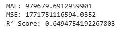
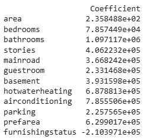
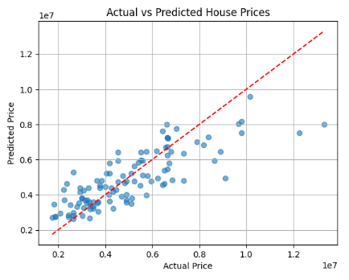

# 🏡 Housing Price Prediction using Linear Regression

Welcome to the **Housing Price Prediction Project**! This project uses **Linear Regression** to predict house prices based on various features like area, number of bedrooms, furnishing status, and more.

---

## 🎯 Objective

The goal of this task is to:
- Implement **Simple & Multiple Linear Regression**
- Use real-world housing data to **train**, **predict**, and **evaluate** a regression model
- Visualize relationships and **interpret coefficients** to understand price drivers

---

## 🛠️ Tools & Libraries Used

- **Python**
- **Pandas** for data manipulation  
- **Matplotlib** for visualization  
- **Scikit-learn** for machine learning & evaluation  

---

## 🚀 How It Works

1. **Load and preprocess** the dataset (`housing.csv`)
2. **Encode** categorical variables into numerical values
3. **Split** the dataset into training and testing sets
4. **Train** a Linear Regression model on the training data
5. **Predict** on test data and evaluate model performance
6. **Plot** predicted vs actual prices and **analyze** feature impact

---

## 📈 Model Evaluation & Output

  

---

## 🔍 Feature Coefficients

These values indicate how much each feature contributes to the price prediction:

  

📌 *Note: A negative coefficient (e.g., furnishingstatus) suggests it reduces the predicted price.*

---

## 📊 Visualization

  
*Actual vs Predicted House Prices*

---

## ✨ Final Thoughts

Despite the simplicity of linear regression, this model captures a good portion of the variance in housing prices. With further feature engineering or advanced models (like Random Forest or XGBoost), accuracy can be improved.

---
